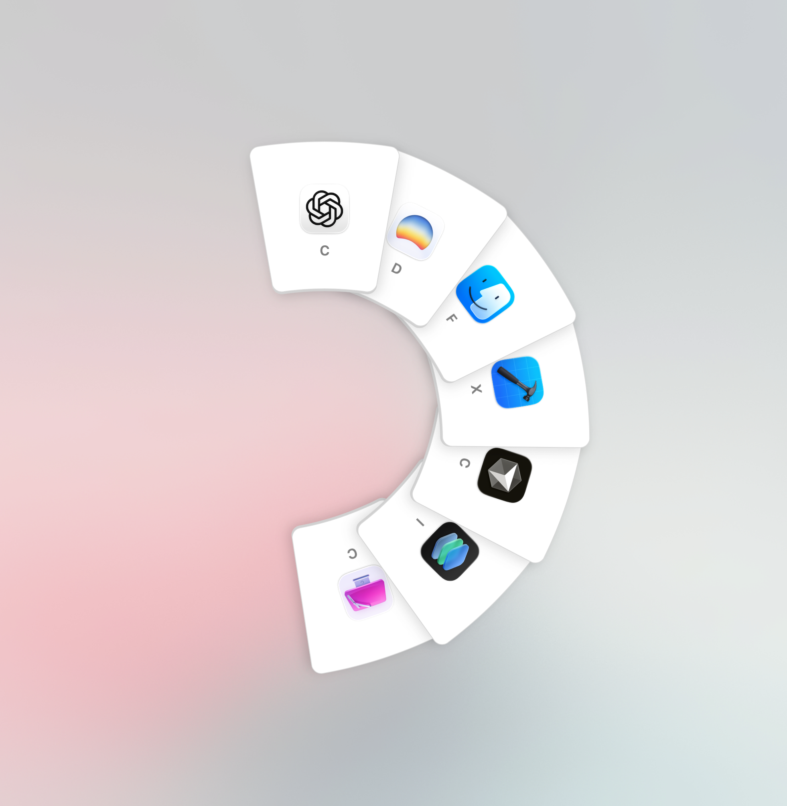
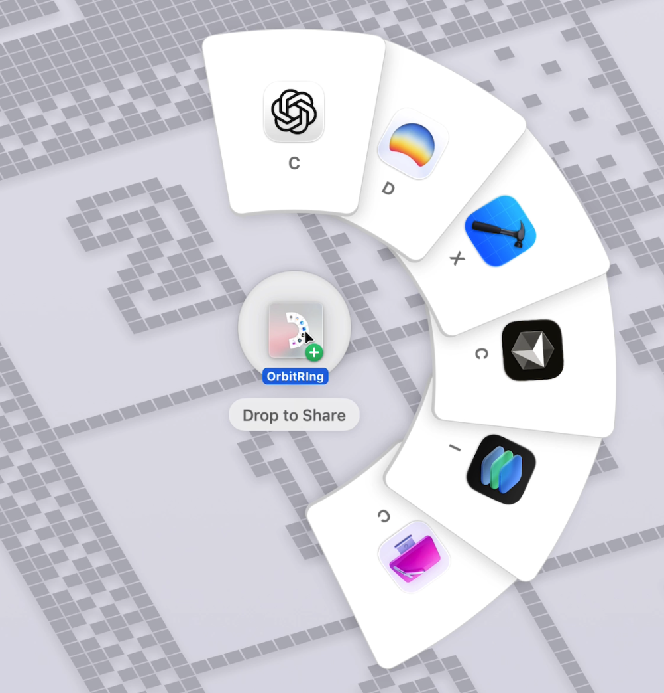
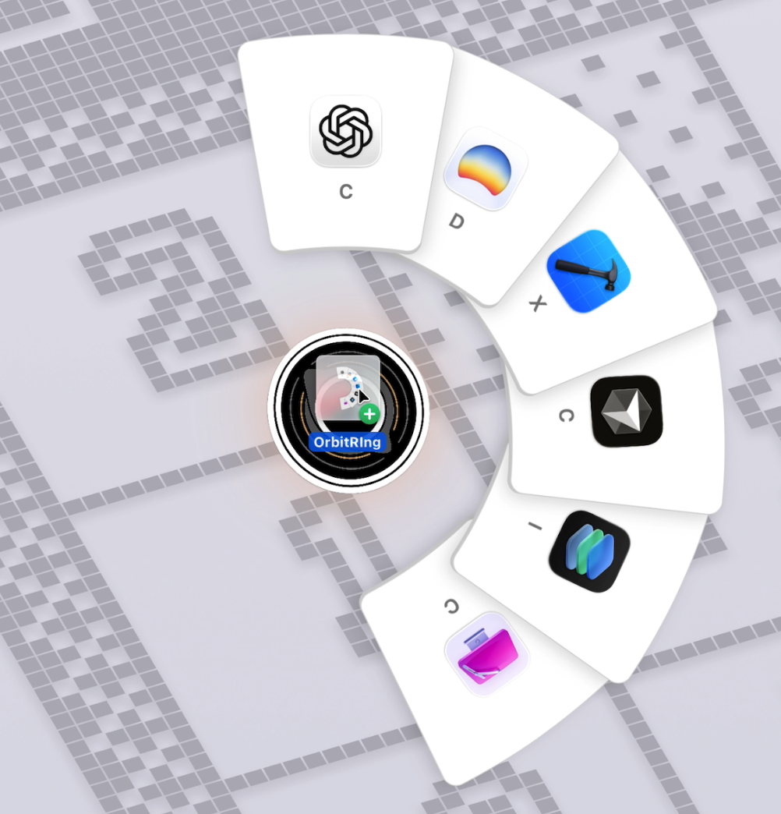
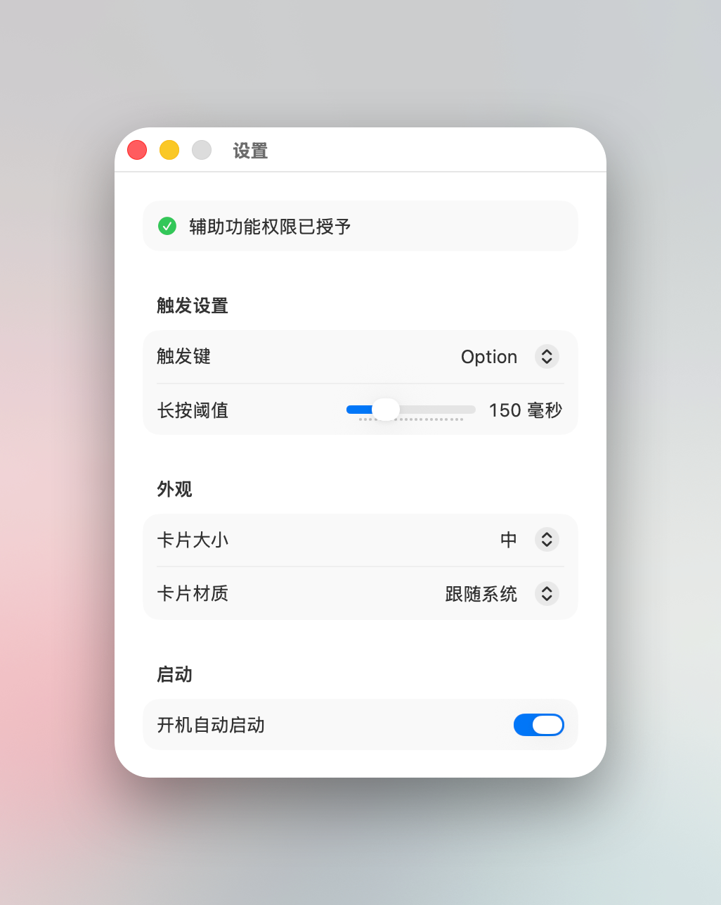
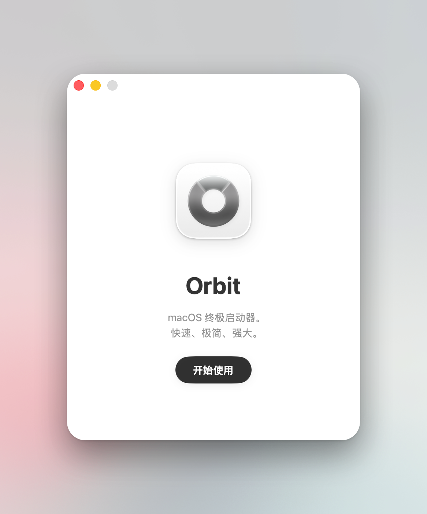

<p align="center">
  <picture>
    <source media="(prefers-color-scheme: dark)" srcset="photos/Orbit-macOS-Dark-1024x1024@1x.png">
    <source media="(prefers-color-scheme: light)" srcset="photos/Orbit-macOS-Default-1024x1024@1x.png">
    
  </picture>
</p>

<h1 align="center">Orbit</h1>

<p align="center">
  <strong>A radial, gesture-first app switcher and file hub for macOS.</strong>
</p>

<p align="center">
  <a href="#features">Features</a> •
  <a href="#installation">Installation</a> •
  <a href="#screenshots">Screenshots</a> •
  <a href="#usage">Usage</a> •
  <a href="#tech-highlights">Tech</a> •
  <a href="#support-orbit">Support</a> •
  <a href="#contributing">Contributing</a> •
  <a href="#license">License</a> •
  <a href="#中文说明">中文</a>
</p>

Orbit is a native, menu bar companion that surfaces your running apps around the cursor,
so you can jump, manage, and share without leaving your flow. Everything stays on-device.

## Features
- Radial app switcher that appears at your cursor and focuses apps instantly.
- Long-press a modifier key (default: Option ⌥) to summon Orbit anywhere.
- Keyboard navigation: Tab/arrows, 1-9, and first-letter cycling for quick targeting.
- Drag an app into the center "black hole" to quit with a pixel-dissolve animation.
- Drag files into Orbit to AirDrop; hold to morph into a black hole for trash.
- Customizable card size/material, launch-at-login, and menu bar controls.

## Installation
### Manual Download
Download the latest `.dmg` from [Releases](https://github.com/yuzeguitarist/Orbit/releases).

### Homebrew (coming)
```bash
brew install --cask orbit
```

### Source
The source is partially published; a full build from source is not supported yet.
Please use the packaged `.dmg` for now.

### Install on macOS without a paid developer account
Because the app is not signed or notarized, Gatekeeper will warn. Follow these steps:

1) Download the latest `.dmg` from Releases.
2) Open the DMG and drag `Orbit.app` to Applications (or the Applications link in the DMG).
3) First launch (bypass Gatekeeper): in Applications, Control+Click (or right-click)
   Orbit -> Open, confirm the warning and click "Open". If blocked, go to
   System Settings -> Privacy & Security and click "Allow Anyway" / "Open Anyway",
   then open once more.
4) Permissions: grant Accessibility (and Input Monitoring if prompted) in
   System Settings -> Privacy & Security so global hotkeys work. Restart Orbit after granting.
5) Updates: for each new DMG, drag to Applications to replace. If Gatekeeper warns again,
   repeat step 3.
6) Remove quarantine if you see "file is damaged":
   ```bash
   sudo xattr -r -d com.apple.quarantine /Applications/Orbit.app
   ```
   then Control+Click -> Open once.
7) Uninstall: quit Orbit, delete `Applications/Orbit.app`. To erase data, delete
   `~/Library/Containers/com.yuzeguitar.Orbit` and `~/Library/Preferences/com.yuzeguitar.Orbit.plist`.

## Requirements
- macOS 14.6 (Sonoma) or later.
- Accessibility permission for global hotkey activation.
- AirDrop requires compatible devices with Wi-Fi/Bluetooth enabled.

## Screenshots
| Orbit Ring | File Share (AirDrop) | File Delete |
| --- | --- | --- |
|  |  |  |

| App Exit | Settings | Welcome |
| --- | --- | --- |
|  |  |  |

## Usage
- Long-press the trigger modifier to open Orbit at the cursor.
- Hover or click a card to switch apps; press Enter to activate selection.
- Use Tab/arrow keys to cycle, number keys (1-9) to jump, or letters to match names.
- Drag a running app toward the center to quit it.
- Drag files onto the center for AirDrop; keep holding to turn it into a trash drop.
- Right-click the menu bar icon for Settings, permissions, and quit.

## Tech Highlights
- SwiftUI + AppKit hybrid with a borderless NSPanel overlay across spaces.
- Global modifier long-press detection using event taps and Accessibility APIs.
- Custom arc layout with staggered spring animations for fan-out motion.
- Drag-and-drop pipeline with NSDragging, NSSharingService (AirDrop), and FileManager.
- Pixel dissolve effect for app dismissal feedback.

## Support Orbit

<p align="center">
  <strong>If Orbit helps your workflow, you can support development here:</strong>
</p>

<p align="center">
  <a href="https://ko-fi.com/yuzeguitar">
    
  </a>
</p>

<p align="center">
  Ko-fi is for international supporters.
</p>

<p align="center">
  For supporters in mainland China, you can also use WeChat Pay / Alipay (QR code below).
</p>

<p align="center">
  
</p>

## Contributing
Issues and PRs are welcome. Please keep PRs focused and describe the behavior clearly.

## License
This project is partially open-sourced under **GPL-3.0 + Commons Clause**.
See `LICENSE` for details.

In short:
- Free for personal and non-commercial use.
- You may study and modify the open-sourced portions.
- Derivative works must use the same license.
- No selling or commercial use without permission.
- Core/pro features are not included in this repository.

For commercial licensing, contact: yuzeguitar@gmail.com

## 中文说明
Orbit 是一款原生的菜单栏效率工具：长按修饰键即可在鼠标附近展开应用环，
快速切换、管理应用，并支持文件拖拽分享/删除，所有数据本地处理。

### 功能特点
- 环形应用切换器：在鼠标附近展示正在运行的应用，一键切换。
- 长按修饰键触发（默认 Option ⌥），可在设置中自定义。
- 支持键盘导航：Tab/方向键、数字 1-9、首字母循环定位。
- 将应用拖入中心黑洞可退出，带像素消散动画反馈。
- 将文件拖入中心可 AirDrop，继续停留会变成“黑洞”用于删除。
- 可调卡片尺寸/材质，支持开机自启动与菜单栏控制。

### 安装方式
### 手动下载
从 [Releases](https://github.com/yuzeguitarist/Orbit/releases) 下载最新 `.dmg`。

### Homebrew (coming)
```bash
brew install --cask orbit
```

### 源码
源码仅部分公开，暂不支持完整源码构建，请优先使用 `.dmg` 安装包。

### 没有开发者账号时的安装方法
由于应用未签名/未公证，Gatekeeper 会提示风险，可按以下步骤操作:

1) 从 Releases 下载最新 `.dmg`。
2) 打开 DMG，将 `Orbit.app` 拖入 Applications (或 DMG 内的 Applications 链接)。
3) 首次运行: 在 Applications 中 Control+Click (或右键) Orbit -> Open，确认警告并点击 "Open"。
   如仍被拦截，进入 System Settings -> Privacy & Security 点击 "Allow Anyway" / "Open Anyway",
   然后再次打开。
4) 权限: 在 System Settings -> Privacy & Security 授予 Accessibility
   (如提示 Input Monitoring 也请授权)，授权后重启 Orbit。
5) 更新: 下载新 DMG 后拖入 Applications 覆盖即可，如再次提示按步骤 3 处理。
6) 若提示 "file is damaged"，可移除隔离属性:
   ```bash
   sudo xattr -r -d com.apple.quarantine /Applications/Orbit.app
   ```
   然后 Control+Click -> Open 一次。
7) 卸载: 退出 Orbit，删除 `Applications/Orbit.app`。如需清除数据，删除
   `~/Library/Containers/com.yuzeguitar.Orbit` 和 `~/Library/Preferences/com.yuzeguitar.Orbit.plist`。

### 运行要求
- macOS 14.6 (Sonoma) 或更高版本。
- 需要授予 Accessibility 权限以启用全局快捷键。
- AirDrop 需要兼容设备并开启 Wi-Fi/蓝牙。

### 使用方式
- 长按触发键，在鼠标处呼出 Orbit。
- 悬停或点击卡片切换应用，按 Enter 确认。
- Tab/方向键循环，数字 1-9 快速定位，字母按首字母匹配。
- 拖动应用到中心可退出应用。
- 拖入文件到中心触发 AirDrop，继续停留会转为删除。
- 右键菜单栏图标可进入设置或退出。

## 支持作者

<p align="center">
  <strong>如果 Orbit 对你有帮助，欢迎通过下面方式支持持续开发：</strong>
</p>

<p align="center">
  
</p>

<p align="center">
  可使用微信 / 支付宝扫码赞助。
</p>

<p align="center">
  <a href="https://ko-fi.com/yuzeguitar">
    
  </a>
</p>

<p align="center">
  海外用户可使用 Ko-fi 赞助。
</p>

## 许可证
本项目为 **部分开源**，采用 **GPL-3.0 + Commons Clause** 许可证 - 详见 `LICENSE`。

简单来说:
- 个人/非商业免费使用。
- 可学习与修改开源部分。
- 衍生作品需以相同许可证开源。
- 未经许可不得销售或商业使用。
- 核心/专业版功能未包含在本仓库。

商业授权请联系: yuzeguitar@gmail.com

## 支持
- 报告 Bug: https://github.com/yuzeguitarist/Orbit/issues/new?template=bug_report.md
- 功能建议: https://github.com/yuzeguitarist/Orbit/issues/new?template=feature_request.md
- 讨论区: https://github.com/yuzeguitarist/Orbit/discussions

<p align="center">
  Made by <a href="https://github.com/yuzeguitarist">Yuze Pan (潘禹泽)</a>
</p>
